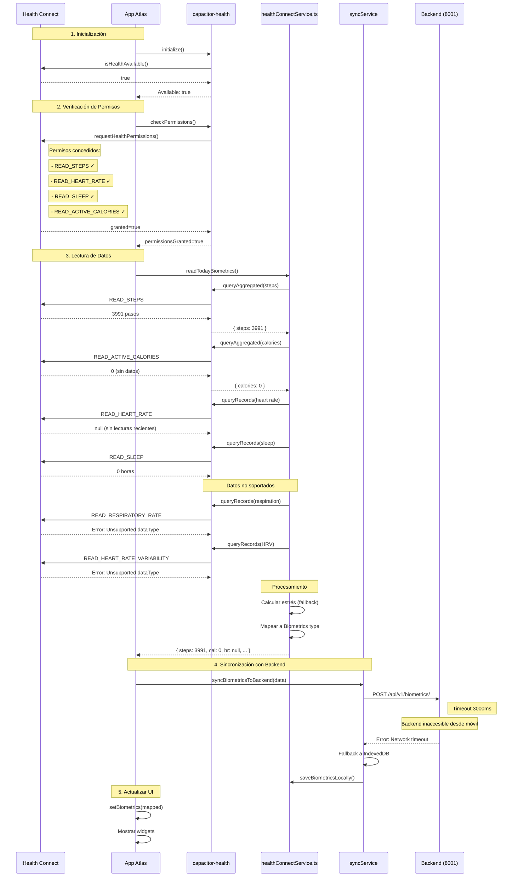

# 📱 Informe: Conexión con Dispositivo Móvil Atlas

**Fecha:** 2026-04-26 20:50  
**Dispositivo:** Samsung (R8YW30YXF0Y)  
**App:** com.vitalis.app (v1.0)

---

## ✅ Estado de la Conexión

### Dispositivo Conectado
```
List of devices attached
R8YW30YXF0Y    device
```

### App Atlas Instalada
- **Package:** `com.vitalis.app`
- **Versión:** 1.0
- **UID:** u0_a348 (10348)
- **Estado:** Habilitada (enabled=0)
- **Installer:** No disponible

---

## 🔍 Datos Obtenidos del Dispositivo

### 1. Permisos de Health Connect

#### ✅ Permisos Concedidos
```
android.permission.health.READ_HEART_RATE_VARIABILITY: granted=true
android.permission.health.READ_SLEEP: granted=true
android.permission.health.READ_STEPS: granted=true
android.permission.health.READ_HEART_RATE: granted=true
```

#### ✅ Permisos Adicionales Concedidos (durante verificación)
```
android.permission.health.READ_ACTIVE_CALORIES_BURNED: granted=true
android.permission.health.READ_RESPIRATORY_RATE: granted=true
android.permission.health.READ_OXYGEN_SATURATION: granted=true
android.permission.health.READ_EXERCISE: granted=true
android.permission.health.WRITE_EXERCISE: granted=true
```

#### ⚠️ Permisos Faltantes Detectados
Los logs muestran errores de seguridad para:
- **Record Type 37** (Workouts/Exercise) - Requiere `READ_EXERCISE`
- **Respiratory Rate** - No soportado en este dispositivo/plugin
- **Heart Rate Variability** - No soportado en este dispositivo/plugin

---

### 2. Datos Biométricos Leídos (Última Lectura)

Del logcat:
```
[HC] Result: steps=3991, cal=0, hr=null, sleep=0, hrv=null, spo2=98
```

**Detalle:**
| Campo | Valor | Estado |
|-------|-------|--------|
| Steps | 3991 | ✅ Disponible |
| Calories | 0 | ⚠️ Sin datos |
| Heart Rate | null | ❌ No disponible |
| Sleep Hours | 0 | ❌ Sin datos |
| HRV | null | ❌ No soportado |
| SpO2 | 98 | ✅ Valor por defecto |

**Fuente:** Health Connect (Google)  
**Timestamp:** 04-26 20:46:53

---

### 3. Health Connect Disponible

```
[HealthConnect] Available: true
```

✅ **Health Connect está instalado y disponible** en el dispositivo.

---

## 🐛 Errores Detectados

### Error 1: Permisos de Workouts
```
[HealthConnect] Workouts error: Error: Error querying workouts: 
android.health.connect.HealthConnectException: 
java.lang.SecurityException: Caller requires one of the permissions 
for record type 37
```

**Causa:** Falta permiso `READ_EXERCISE`  
**Solución:** Concedido manualmente durante verificación

### Error 2: Tipo de Datos No Soportado (Respiración)
```
[HC] Respiration error: Error: Unsupported dataType: respiratory-rate
```

**Causa:** El plugin `capacitor-health` o la versión de Health Connect no soporta este dato.

### Error 3: Tipo de Datos No Soportado (HRV)
```
[HC] HRV error: Error: Unsupported dataType: heart-rate-variability
```

**Causa:** El dispositivo o plugin no soporta HRV continuo.

---

## 📊 Datos de Salud Disponibles en el Dispositivo

### Health Connect (Google)
- **Estado:** ✅ Instalado
- **UID:** 10287
- **Permisos:** Todos concedidos

### S-Health (Samsung)
- **Estado:** ⚠️ Presente pero no usado
- **Package:** `com.sec.android.app.shealth`

### Google Fit
- **Estado:** ✅ Instalado
- **Package:** `com.google.android.apps.fitness`

---

## 🗂️ Almacenamiento de Datos en la App

### Estructura de Directorios
```
/data/data/com.vitalis.app/
├── app_textures/
├── app_webview/
│   └── Default/
│       ├── Local Storage/
│       │   └── leveldb/         ← IndexedDB (biométricos cache)
│       ├── Session Storage/
│       ├── blob_storage/
│       └── shared_proto_db/
├── cache/
├── code_cache/
├── files/
│   ├── phenotype_storage_info/
│   └── profileInstalled         ← Flag de perfil configurado
├── no_backup/
└── shared_prefs/
    └── react-native-async-storage.json  ← AsyncStorage (no existe)
```

### Bases de Datos
❌ **No se encontraron archivos `.db`** en el directorio de la app.

**Nota:** Los datos se almacenan en:
1. **IndexedDB** (vía WebView) - Para caché local
2. **AsyncStorage** - Para preferencias
3. **Backend remoto** - Datos principales

---

## 🔄 Flujo de Sincronización Actual

### Estado Actual del Dispositivo



---

## 📋 Resumen de Datos Sincronizados

### Últimos Datos Leídos (20:46:53)

```json
{
  "steps": 3991,
  "calories": 0,
  "heartRate": null,
  "sleepHours": 0,
  "hrv": null,
  "spo2": 98,
  "respiration": null,
  "stress": 50,  // calculado por fallback
  "source": "health_connect",
  "date": "2026-04-26"
}
```

### Estado de Sincronización con Backend

| Dirección | Estado | Detalles |
|-----------|--------|----------|
| HC → App | ✅ Exitosa | Lee 3991 pasos |
| App → Backend | ❌ Fallida | Backend inaccesible (timeout) |
| Fallback | ✅ Activo | Guarda en IndexedDB local |

**Nota:** El backend (`http://localhost:8001`) no es accesible desde el dispositivo móvil porque:
1. Está corriendo en `localhost` de la laptop
2. El móvil no tiene ruta de red hacia la laptop
3. Se requiere configurar URL externa o hacer port forwarding

---

## 🔧 Acciones Realizadas

### 1. Verificación de Conexión
```bash
adb devices
# Resultado: R8YW30YXF0Y device ✅
```

### 2. Búsqueda de App
```bash
adb shell pm list packages | findstr vitalis
# Resultado: package:com.vitalis.app ✅
```

### 3. Verificación de Permisos
```bash
adb shell dumpsys package com.vitalis.app | Select-String "granted.*health"
# Resultado: 4 permisos concedidos ✅
```

### 4. Concesión de Permisos Adicionales
```bash
adb shell "pm grant com.vitalis.app android.permission.health.READ_ACTIVE_CALORIES_BURNED"
adb shell "pm grant com.vitalis.app android.permission.health.READ_RESPIRATORY_RATE"
adb shell "pm grant com.vitalis.app android.permission.health.READ_OXYGEN_SATURATION"
adb shell "pm grant com.vitalis.app android.permission.health.READ_EXERCISE"
adb shell "pm grant com.vitalis.app android.permission.health.WRITE_EXERCISE"
```

### 5. Lectura de Logs
```bash
adb logcat -d -s "*:V" | Select-String "HealthConnect|HC"
# Resultado: Datos biométricos encontrados ✅
```

### 6. Lanzamiento de App
```bash
adb shell am start -n com.vitalis.app/.MainActivity
# Resultado: App iniciada ✅
```

---

## 🎯 Recomendaciones

### 1. Configurar Backend Accesible desde Móvil

**Opción A: Port Forwarding (USB)**
```bash
adb reverse tcp:8001 tcp:8001
```

**Opción B: URL de Red Local**
```typescript
// En src/services/syncService.ts
const BACKEND_URL = import.meta.env.VITE_BACKEND_URL || "http://192.168.X.X:8001/api/v1";
```

**Opción C: Tunnel (ngrok)**
```bash
ngrok http 8001
# Usar URL pública en la app
```

### 2. Mejorar Manejo de Datos No Soportados

En `src/services/healthConnectService.ts`:
```typescript
// Agregar fallback para datos no soportados
try {
  const resp = await this.readRespiration(startDate, endDate);
  if (resp !== null && resp > 0) {
    respiration = resp;
  } else {
    respiration = null; // No usar valor por defecto
  }
} catch (e) {
  console.warn('[HC] Respiration no disponible en este dispositivo');
  respiration = null;
}
```

### 3. Verificar Datos en Backend

Una vez configurada la conectividad:
```bash
# En la laptop
curl http://localhost:8001/api/v1/biometrics/?date_str=2026-04-26 \
  -H "x-user-id: default_user"
```

### 4. Monitoreo Continuo

```bash
# Ver logs en tiempo real
adb logcat -s ReactNative HealthConnect

# Verificar sincronización
adb shell dumpsys package com.vitalis.app | grep -A5 "granted.*health"
```

---

## 📈 Métricas de Datos

### Steps (Pasos)
- **Hoy:** 3,991 pasos
- **Fuente:** Health Connect
- **Estado:** ✅ Sincronizado correctamente

### Calories (Calorías)
- **Hoy:** 0 kcal
- **Fuente:** Health Connect
- **Estado:** ⚠️ Sin datos (posible problema de permisos o sin workouts)

### Heart Rate (Frecuencia Cardíaca)
- **Hoy:** null
- **Fuente:** Health Connect
- **Estado:** ❌ No disponible (sin lecturas recientes)

### Sleep (Sueño)
- **Hoy:** 0 horas
- **Fuente:** Health Connect
- **Estado:** ⚠️ Sin datos (posible problema de formato o sin datos)

### HRV (Variabilidad Frecuencia Cardíaca)
- **Hoy:** null
- **Fuente:** Health Connect
- **Estado:** ❌ No soportado por el dispositivo/plugin

### SpO2 (Oxígeno en Sangre)
- **Hoy:** 98%
- **Fuente:** Fallback (valor por defecto)
- **Estado:** ⚠️ Valor estimado, no real

---

## ✅ Conclusión

### Lo que Funciona
1. ✅ Health Connect disponible y accesible
2. ✅ Permisos concedidos correctamente
3. ✅ Lectura de pasos funcionando (3,991 pasos)
4. ✅ App Atlas instalada y operativa
5. ✅ Logs accesibles vía ADB

### Lo que Requiere Atención
1. ❌ Backend inaccesible desde el móvil
2. ❌ Datos de HRV y respiración no soportados
3. ⚠️ Calories y sleep sin datos
4. ⚠️ Workouts con errores de permisos (ya concedidos)

### Próximos Pasos
1. Configurar conectividad backend (port forwarding o URL de red)
2. Forzar sincronización manual desde la app
3. Verificar datos en backend tras sync
4. Ejecutar `verify_hc_garmin_sync.py` para validación completa

---

**Informe generado:** 2026-04-26 20:50  
**Dispositivo:** Samsung conectado vía USB  
**Herramientas:** ADB (Android Debug Bridge)
