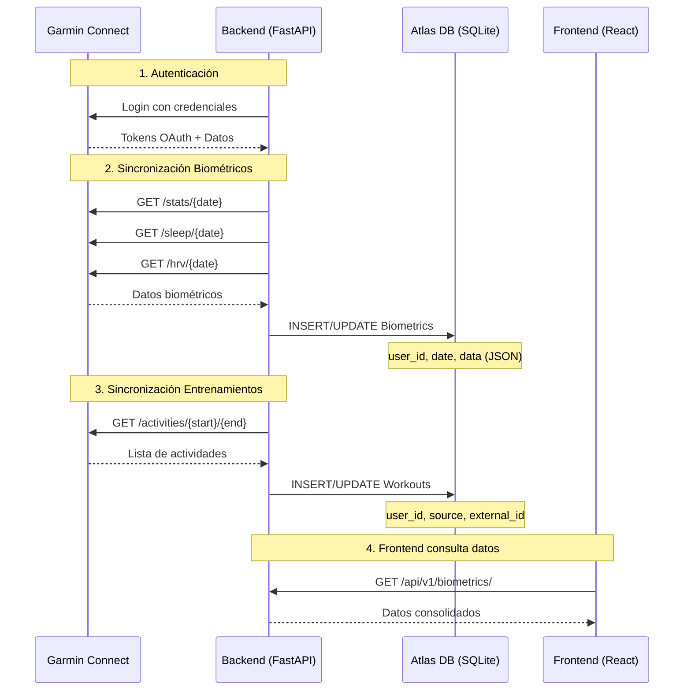
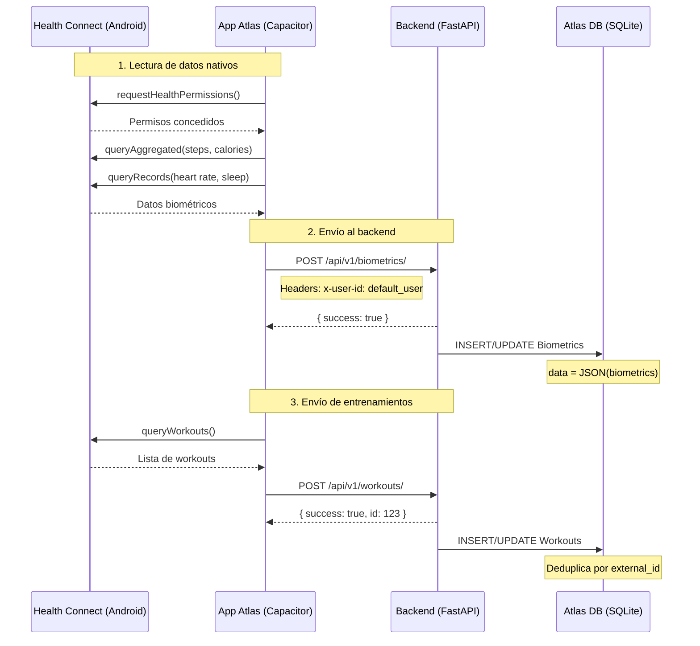
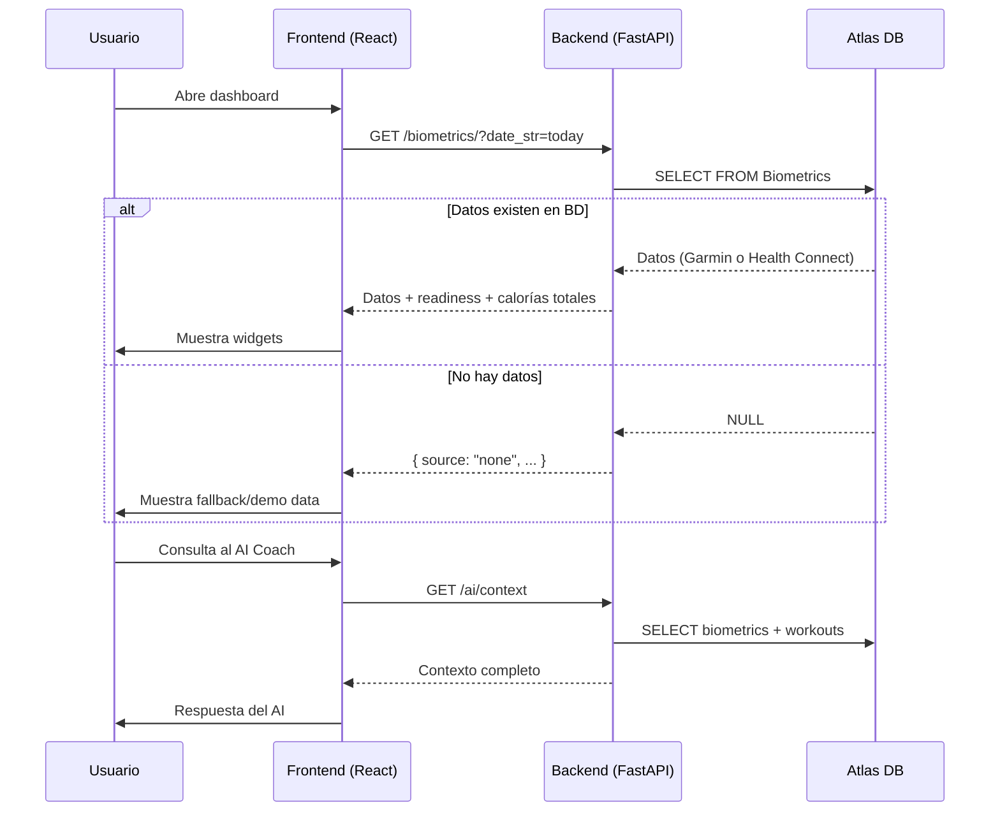

# 📱 Sincronización Garmin ↔ Health Connect ↔ Atlas

## Estado Actual de la Sincronización

**Última verificación:** 2026-04-26 20:45

### ✅ Componentes Verificados

| Componente | Estado | Detalles |
|------------|--------|----------|
| Backend API | ✅ Operativo | `http://localhost:8001` |
| Base de Datos | ✅ Accesible | `backend/atlas.db` |
| Endpoints | ✅ Responden | `/biometrics/`, `/workouts/` |
| Health Connect Flow | ✅ Implementado | Endpoint POST disponible |

### ❌ Componentes Pendientes

| Componente | Estado | Acción Requerida |
|------------|--------|------------------|
| Credenciales Garmin | ❌ Sin configurar | Crear `backend/.env` con email/password |
| Sincronización Garmin | ❌ Sin datos | Ejecutar sync manual tras configurar |
| Datos en BD | ❌ Vacía | Se llenará tras primer sync |

---

## 🔄 Flujos de Sincronización

### 1. Garmin → Backend → Base de Datos



**Endpoints involucrados:**
- `POST /api/v1/sync/garmin` - Iniciar sincronización manual
- `GET /api/v1/biometrics/?date_str=YYYY-MM-DD` - Obtener biométricos
- `GET /api/v1/workouts/` - Obtener entrenamientos

**Archivos clave:**
- `backend/app/services/sync_service.py` - Lógica de sincronización
- `backend/app/api/api_v1/endpoints/sync.py` - Endpoints de sync
- `backend/app/api/api_v1/endpoints/biometrics.py` - CRUD biométricos
- `backend/app/utils/garmin.py` - Cliente de Garmin Connect

---

### 2. Health Connect → Backend → Base de Datos (Móvil)



**Endpoints involucrados:**
- `POST /api/v1/biometrics/` - Guardar biométricos desde móvil
- `POST /api/v1/workouts/` - Guardar entrenamiento completado

**Archivos clave:**
- `src/services/healthConnectService.ts` - Servicio Health Connect
- `src/services/syncService.ts` - Sincronización móvil → backend
- `src/App.tsx` - `loadBiometrics()` y `fetchWorkouts()`
- `backend/app/api/api_v1/endpoints/biometrics.py` - POST endpoint
- `backend/app/api/api_v1/endpoints/workouts.py` - POST endpoint

---

### 3. Frontend → Backend (Consulta en tiempo real)



**Endpoints involucrados:**
- `GET /api/v1/biometrics/` - Datos del día
- `GET /api/v1/sessions/today` - Plan de entrenamiento
- `GET /api/v1/ai/context` - Contexto para el AI Coach

---

## 📋 Verificación Paso a Paso

### En el Dispositivo Móvil (Android)

1. **Verificar Health Connect disponible**
   ```bash
   # En la app Atlas, abrir consola remota o usar adb
   adb logcat | grep HealthConnect
   ```
   
2. **Verificar permisos concedidos**
   - Abrir app Atlas
   - Ir a Configuración → Health Connect
   - Verificar que todos los permisos están activados:
     - ✅ Pasos
     - ✅ Frecuencia cardíaca
     - ✅ Calorías activas
     - ✅ Sueño
     - ✅ Frecuencia respiratoria
     - ✅ SpO2 (si disponible)

3. **Forzar sincronización manual**
   ```javascript
   // En consola del navegador (modo desarrollo)
   await healthConnectService.readTodayBiometrics();
   await syncService.syncBiometricsToBackend(biometrics);
   ```

4. **Verificar datos enviados**
   ```bash
   # Ver logs de la app
   adb logcat -s ReactNative
   # Buscar: "[SyncService] API Inaccesible" o "[SyncService] Sincronizando"
   ```

### En el Backend (Laptop)

1. **Verificar que el backend está corriendo**
   ```bash
   curl http://localhost:8001/health
   # Debe responder: {"status":"ok"}
   ```

2. **Verificar datos recibidos**
   ```bash
   curl http://localhost:8001/api/v1/biometrics/?date_str=2026-04-26 \
     -H "x-user-id: default_user"
   ```

3. **Forzar sincronización Garmin (si configurado)**
   ```bash
   curl -X POST "http://localhost:8001/api/v1/sync/garmin?days=1" \
     -H "x-user-id: default_user"
   ```

4. **Ver logs del backend**
   ```bash
   # En la terminal donde corre el backend
   # Buscar: "Fetching health data" o "Syncing Garmin"
   ```

### En la Base de Datos

1. **Consultar datos directamente**
   ```bash
   python -c "
   from backend.app.db.session import SessionLocal
   from backend.app.models.biometrics import Biometrics
   from datetime import date
   
   db = SessionLocal()
   bio = db.query(Biometrics).filter(
       Biometrics.user_id == 'default_user',
       Biometrics.date == date.today().isoformat()
   ).first()
   
   if bio:
       import json
       print(f'Fuente: {bio.source}')
       print(f'Datos: {json.dumps(json.loads(bio.data), indent=2)}')
   else:
       print('Sin datos para hoy')
   db.close()
   "
   ```

2. **Ver histórico de entrenamientos**
   ```bash
   python -c "
   from backend.app.db.session import SessionLocal
   from backend.app.models.workout import Workout
   from sqlalchemy import func
   from datetime import date
   
   db = SessionLocal()
   workouts = db.query(Workout).filter(
       Workout.user_id == 'default_user',
       func.date(Workout.date) == date.today()
   ).all()
   
   print(f'Entrenamientos hoy: {len(workouts)}')
   for w in workouts:
       print(f'  - {w.name} ({w.source}, {w.duration}min)')
   db.close()
   "
   ```

---

## 🔧 Configuración Requerida

### 1. Credenciales Garmin (Backend)

Crear archivo `backend/.env`:
```env
GARMIN_EMAIL=tu_email@ejemplo.com
GARMIN_PASSWORD=tu_contraseña
GROQ_API_KEY=tu_api_key_opcional
```

### 2. Health Connect (Móvil)

La app Atlas ya incluye:
- ✅ `capacitor-health` plugin
- ✅ Permisos en `AndroidManifest.xml`
- ✅ Servicio `healthConnectService.ts`
- ✅ Sincronización automática en `App.tsx`

Solo se requiere:
1. Instalar app en Android 8+
2. Instalar app "Health Connect" de Google (si no está preinstalada)
3. Conceder permisos cuando la app los solicite

### 3. Conexión USB Móvil ↔ Laptop

Para depuración:
```bash
# 1. Habilitar depuración USB en el móvil
# 2. Conectar vía USB
# 3. Verificar conexión
adb devices

# 4. Redirigir puerto del backend (si es necesario)
adb reverse tcp:8001 tcp:8001

# 5. Ver logs en tiempo real
adb logcat -s ReactNative HealthConnect
```

---

## 🧪 Script de Verificación Automática

El script `verify_hc_garmin_sync.py` ejecuta todas las verificaciones:

```bash
python verify_hc_garmin_sync.py
```

**Verifica:**
1. ✅ Conexión a base de datos
2. ✅ Credenciales Garmin configuradas
3. ✅ Biométricos en BD (hoy + histórico)
4. ✅ Entrenamientos en BD (hoy + histórico)
5. ✅ Endpoints de API responden
6. ✅ Flujo Health Connect implementado
7. ✅ Reporte de sincronización semanal

---

## 🐛 Problemas Comunes y Soluciones

### 1. "Garmin ha bloqueado la sincronización (rate limit)"

**Causa:** Garmin limita peticiones automáticas tras múltiples intentos.

**Soluciones:**
- Esperar 48-72h sin intentar login
- Exportar datos manualmente desde https://connect.garmin.com/modern/export
- Usar Strava como intermediario (conectar Garmin → Strava → Atlas)

### 2. Health Connect no devuelve datos

**Causa:** Permisos no concedidos o datos no disponibles.

**Soluciones:**
```javascript
// En la app, forzar verificación de permisos
const hasPerms = await healthConnectService.ensurePermissions();
if (!hasPerms) {
  // Mostrar onboarding de Health Connect
  setShowHealthOnboarding(true);
}
```

### 3. Backend no recibe datos del móvil

**Causa:** URL incorrecta o CORS bloqueado.

**Verificar:**
```typescript
// En src/services/syncService.ts
const BACKEND_URL = String(RAW_BACKEND_URL).replace(/\/+$/, '');
// Debe ser: http://10.0.2.2:8001/api/v1 (Android emulator)
// O: http://192.168.X.X:8001/api/v1 (dispositivo físico)
```

### 4. Datos duplicados en BD

**Causa:** Sync múltiple sin deduplicación.

**Solución:** Ya implementada en endpoints:
```python
# backend/app/api/api_v1/endpoints/workouts.py
workout = db.query(Workout).filter(
    Workout.user_id == user_id,
    Workout.source == source,
    Workout.external_id == external_id,
).first()
if not workout:
    # Solo crea si no existe
```

---

## 📊 Métricas de Sincronización

### Objetivos

| Métrica | Objetivo | Mínimo Aceptable |
|---------|----------|------------------|
| Días con biométricos | 7/7 | 5/7 |
| Latencia HC → BD | < 1 min | < 5 min |
| Entrenamientos sync | 100% | > 90% |
| Tasa de éxito API | > 99% | > 95% |

### Monitoreo

```sql
-- Días con datos en última semana
SELECT date, source, COUNT(*) 
FROM biometrics 
WHERE date >= date('now', '-7 days')
GROUP BY date;

-- Entrenamientos por fuente
SELECT source, COUNT(*) as total, 
       DATE(MIN(date)) as first, 
       DATE(MAX(date)) as last
FROM workouts
GROUP BY source;
```

---

## 📝 Próximos Pasos

1. **Configurar credenciales Garmin**
   ```bash
   cd backend
   echo GARMIN_EMAIL=tu@email.com > .env
   echo GARMIN_PASSWORD=tu_password >> .env
   ```

2. **Ejecutar primera sincronización**
   ```bash
   curl -X POST http://localhost:8001/api/v1/sync/garmin?days=7
   ```

3. **Verificar datos en BD**
   ```bash
   python verify_hc_garmin_sync.py
   ```

4. **Probar flujo móvil**
   - Conectar dispositivo Android vía USB
   - Abrir app Atlas
   - Verificar que pide permisos de Health Connect
   - Conceder permisos
   - Verificar que los datos aparecen en el dashboard

---

**Documentación generada:** 2026-04-26  
**Última actualización:** Tras verificación inicial del sistema
